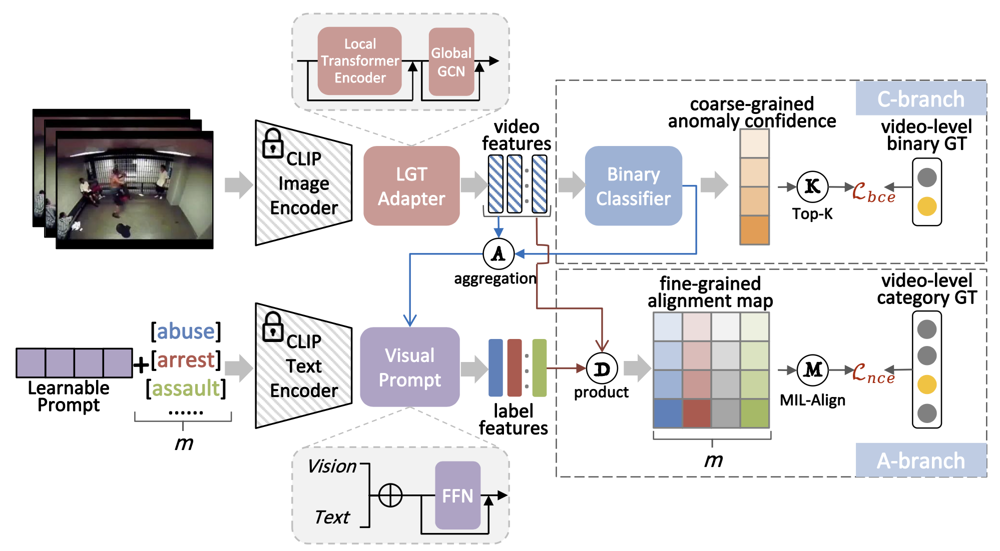

# 视频异常事件检测系统

[English](./src/README_EN.md) | 简体中文

**一个基于多模态学习的视频异常事件检测系统，专门针对车辆碰撞检测优化，支持多种异常事件的识别和定位。**

## 特性

- 🎯 **多模态融合**: 结合视觉与文本信息，提升检测准确性
- ⏱️ **时序定位**: 精确检测异常事件的起始和结束时间
- 🚀 **高效推理**: 支持实时视频流处理
- 🔧 **弱监督学习**: 仅需视频级标签即可训练时间定位模型
- 📊 **多任务学习**: 同时完成异常检测、事件分类和时间定位

## 支持的异常事件

- 🚗 车辆碰撞
- 🔥 火灾
- 👊 打斗
- 🧍 摔倒
- ✅ 正常场景

## 环境要求

- Python 3.8+
- PyTorch 1.12+
- CUDA 11.0+ (GPU推荐)

## 安装

1. 克隆仓库：
   
   ```bash
   git clone https://github.com/YanjunTong/VisionGuard.git
   cd VisionGuard
   ```

2. 安装依赖：
   
   ```bash
   pip install torch torchvision
   pip install opencv-python pillow clip-by-openai
   pip install numpy tqdm
   ```

## 快速开始

1. **数据预处理**

```bash
python process.py
```

2. **模型训练**

```bash
python train.py
```

2. **推理检测**

```bash
python inference.py
```

## 项目结构

```
video-anomaly-detection/
├── process.py          # 数据预处理和特征提取
├── train.py           # 模型训练脚本
├── inference.py       # 推理检测脚本
├── preprocessed_data/ # 预处理特征存储
│   ├── video_features/
│   ├── text_features/
│   └── sim_matrices/
├── saved_models/      # 训练好的模型权重
├── pseudo_labels/     # 伪标签数据
└── README.md
```

## 数据准备

1. **视频数据**

将训练视频放置在 train_videos/ 目录下，测试视频放置在 video/ 目录下。

2. **文本描述**

在 process.py 中配置视频对应的文本描述：

```python
TEST_TEXT_DESC_DICT = {
    "video_001": ["检测撞击", "视频中有车辆出现碰撞", ...],
    "normal_001": ["检测正常", "视频中无异常事件", ...]
}
```

## 模型架构

系统采用三头网络结构：

· 融合模块: CLIP特征 + 注意力机制
· 异常检测头: 二分类判断是否异常
· 事件分类头: 多分类识别事件类型
· 时间定位头: 回归预测事件时间偏移


## 结果输出

**推理结果保存在 submission.txt 中，格式为：**

```
视频ID 起始帧 结束帧 事件类型
示例: car_01 125 189 车辆碰撞
```

## 训练配置

**关键训练参数：**

· 批大小: 32
· 学习率: 1e-4
· 训练轮数: 500
· 帧数/片段: 16
· 滑动步长: 8

## 性能优化

· 使用CLIP ViT-B/32模型平衡精度与速度
· 滑动窗口策略避免漏检
· 特征预计算加速训练过程

**许可证**

[MIT License](https://mit-license.org/)

**引用**

如果您使用了本项目，请引用：

```bibtex
@software{VisionGuard2025,
  title = {VisionGuard},
  author = {Tong, Yanjun and Liang, Tianyv},
  year = {2025},
  url = {https://github.com/YanjunTong/VisionGuard}
}

@inproceedings{CLIP,
  title = {Learning Transferable Visual Models From Natural Language Supervision},
  author = {Radford, Alec and Kim, Jong Wook and Hallacy, Chris and Ramesh, Aditya and Goh, Gabriel and Agarwal, Sandhini and Sastry, Girish and Askell, Amanda and Mishkin, Pamela and Clark, Jack and others},
  booktitle = {International Conference on Machine Learning},
  pages = {8748--8763},
  year = {2021},
  organization = {PMLR}
}
```

**贡献**

欢迎提交 Issue 和 Pull Request！

**联系方式**

· 邮箱: yanjun_tong@outlook.com
· GitHub: @yanjuntong
