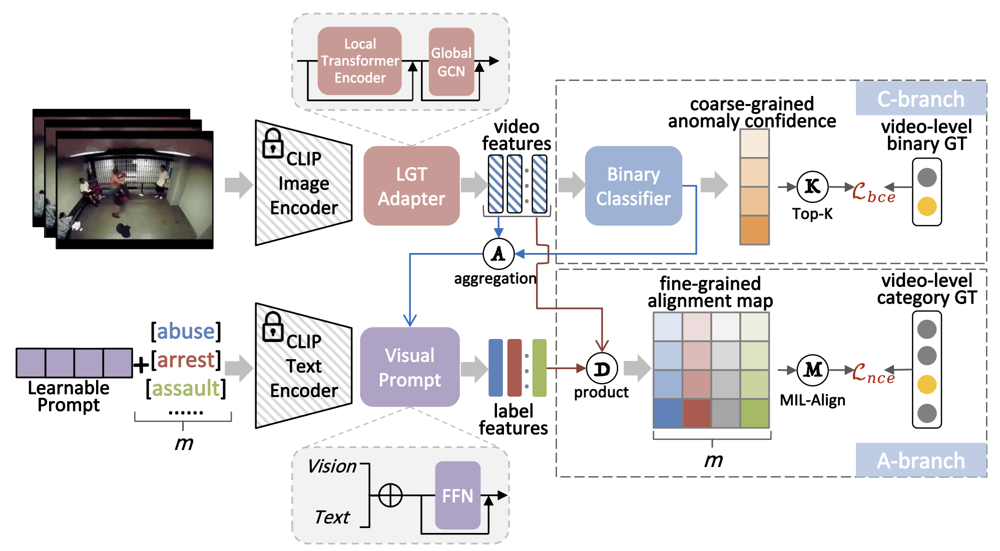

```
# 视频异常事件检测系统

[English](./src/README_EN.md) | 简体中文

一个基于多模态学习的视频异常事件检测系统，专门针对车辆碰撞检测优化，支持多种异常事件的识别和定位。


## 特性

- 🎯 **多模态融合**: 结合视觉与文本信息，提升检测准确性
- ⏱️ **时序定位**: 精确检测异常事件的起始和结束时间
- 🚀 **高效推理**: 支持实时视频流处理
- 🔧 **弱监督学习**: 仅需视频级标签即可训练时间定位模型
- 📊 **多任务学习**: 同时完成异常检测、事件分类和时间定位

## 支持的异常事件

- 🚗 车辆碰撞
- 🔥 火灾
- 👊 打斗
- 🧍 摔倒
- ✅ 正常场景

## 环境要求

- Python 3.8+
- PyTorch 1.12+
- CUDA 11.0+ (GPU推荐)

## 安装

1. 克隆仓库：
```bash
git clone https://github.com/YanjunTong/VisionGuard.git
cd VisionGuard
```

1. 安装依赖：

```bash
pip install torch torchvision
pip install opencv-python pillow clip-by-openai
pip install numpy tqdm
```

快速开始

数据预处理

```bash
python process.py
```

模型训练

```bash
python train.py
```

推理检测

```bash
python inference.py
```

项目结构

```
video-anomaly-detection/
├── process.py          # 数据预处理和特征提取
├── train.py           # 模型训练脚本
├── inference.py       # 推理检测脚本
├── preprocessed_data/ # 预处理特征存储
│   ├── video_features/
│   ├── text_features/
│   └── sim_matrices/
├── saved_models/      # 训练好的模型权重
├── pseudo_labels/     # 伪标签数据
└── README.md
```

数据准备

视频数据

将训练视频放置在 train_videos/ 目录下，测试视频放置在 video/ 目录下。

文本描述

在 process.py 中配置视频对应的文本描述：

```python
TEST_TEXT_DESC_DICT = {
    "video_001": ["检测撞击", "视频中有车辆出现碰撞", ...],
    "normal_001": ["检测正常", "视频中无异常事件", ...]
}
```

模型架构

系统采用三头网络结构：

· 融合模块: CLIP特征 + 注意力机制
· 异常检测头: 二分类判断是否异常
· 事件分类头: 多分类识别事件类型
· 时间定位头: 回归预测事件时间偏移

结果输出

推理结果保存在 submission.txt 中，格式为：

```
视频ID 起始帧 结束帧 事件类型
示例: car_01 125 189 车辆碰撞
```

训练配置

关键训练参数：

· 批大小: 32
· 学习率: 1e-4
· 训练轮数: 500
· 帧数/片段: 16
· 滑动步长: 8

性能优化

· 使用CLIP ViT-B/32模型平衡精度与速度
· 滑动窗口策略避免漏检
· 特征预计算加速训练过程

许可证

MIT License

引用

如果您使用了本项目，请引用：

```bibtex
@software{VideoAnomalyDetection2024,
  title = {VisionGuard},
  author = {Tong, Yanjun and Liang, Tianyv},
  year = {2025},
  url = {https://github.com/YanjunTong/VisionGuard}
}
```

贡献

欢迎提交 Issue 和 Pull Request！

联系方式

· 邮箱: yanjun_tong@outlook.com
· GitHub: @yanjuntong

```